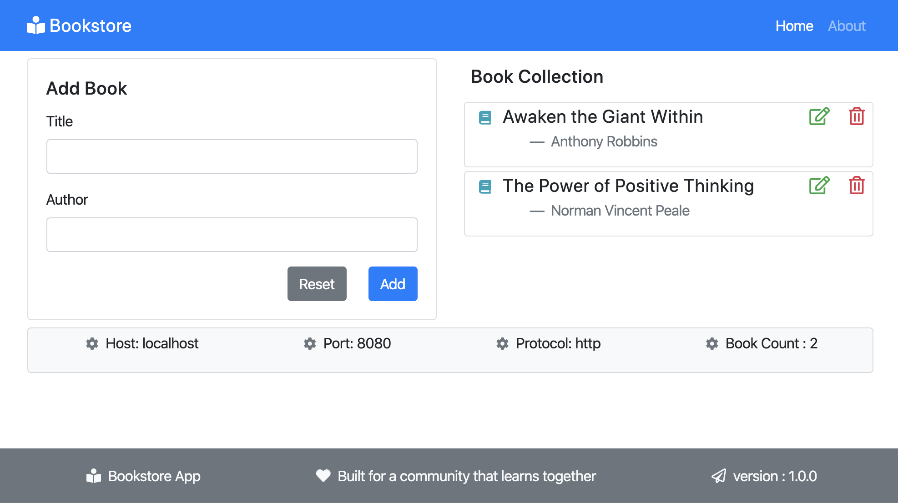

## Bookstore App
-----------------

- Base URL: localhost:8080/api/books
- Version : 1.0.0

This application is built to test the CRUD functionality. It can be used to perform POC's for various cloud-native initiatives.




### API's exposed as below :


    EXAMPLE : curl http://localhost:8080/api/books
    
    
    => api/books
    Type : GET
    Desc : Fetch all books from the store
    
    => api/books/{bookId}
    Type : GET
    Desc : To fetch single book from store based on it's BookId"
    
    => api/books
    Type : POST
    Desc : To Add a book to the store
    
    Note : primary key as Id is auto-assigned
    Body : 
	    {
		  "title":"Life is beautiful", 
		  "author":"Tony Martin"
		}
		
    => api/books/{bookId}
    Type : PUT
    Desc : To edit and change "title" and/or "author" for the book already saved in store
    
    => api/books/{bookId}
    Type : DELETE
    Desc : To delete the book from the store based on the "BookId"
       
#### Config properties :

``` 
  spring.datasource.url=jdbc:mysql://localhost:3306/mydb
  spring.datasource.username=root
  spring.datasource.password=secret
  spring.datasource.driver-class-name=com.mysql.cj.jdbc.Driver
  spring.jpa.hibernate.ddl-auto=update
 
  spring.datasource.url=jdbc:h2:mem:testdb
  spring.datasource.driverClassName=org.h2.Driver
  spring.datasource.username=sa
  spring.datasource.password=
  spring.jpa.database-platform=org.hibernate.dialect.H2Dialect
  
  #Enabling H2 Console
  spring.h2.console.enabled=true
 
  #Custom H2 Console URL
  spring.h2.console.path=/h2
```

#### Accessing from UI :
App Web UI can be accessed at : `http://localhost:8080`
- Form to add book
- List of added books
- Option to **Edit** and **Delete** book
- Labels to view basic stats of app


## Provisioning on Kubernetes cluster

- **Prerequisite :** Kubernetes cluster is running and kube-config configured with the context
- **Build :**  Using Dockerfile
- **Deploy :**  Using Kubernetes yaml resources

### Deploy MySQL Database

`helm install mysql-sit --set mysqlRootPassword=rootpassword,mysqlUser=mysql,mysqlPassword=mypassword,mysqlDatabase=mydb stable/mysql -n sit`

*Note :* During later part after API deployment, the DB would be configured via ConfigMap.

### Dockerfile

```
FROM openjdk:8-jdk-alpine
VOLUME /tmp
ARG JAR_FILE=target/*.jar
COPY ${JAR_FILE} app.jar
ENTRYPOINT ["java","-Djava.security.egd=file:/dev/./urandom","-jar","/app.jar"]
```

### Kubernetes Resources

Kubernetes resources are added in the source code at ./kubernetes/application.yml
- Service
- Deployment

### Build and deploy via Skaffold 

Prerequisite : Need to install skaffold binary in local workstation
Need to create the Skaffold config [ skaffold.yaml ]

```
apiVersion: skaffold/v2beta1
kind: Config
metadata:
  name: bookstore
build:
  artifacts:
  - image: bookstore-api
deploy:
  kubectl:
    manifests:
    - kubernetes/application.yml
```

### Steps to build and deploy to Kubernetes :

Run `skaffold run` from the base folder path

### Configure MySQL Database

As the MySQL db is already deployed, it's time to configure the DB with the API application via ConfigMap

`kubectl -n sit create configmap bookstore-api --from-literal=spring.datasource.url=jdbc:mysql://mysql-sit/mydb --from-literal=spring.datasource.username=mysql --from-literal=spring.datasource.password=mypassword --from-literal=spring.datasource.driver-class-name=com.mysql.cj.jdbc.Driver --from-literal=spring.jpa.database-platform=org.hibernate.dialect.MySQL5InnoDBDialect `

`kubectl set env --from=configmap/bookstore-api deployment/bookstore-api -n sit`

### Outcome

The application would be deployed onto Kubernetes and configured to serve data from MySQL external database.

**For testing purpose :**

`kubectl expose deploy bookstore-api --type=NodePort --name=bookstore-api-np -n sit`


## License
GNU GPL v3.0

